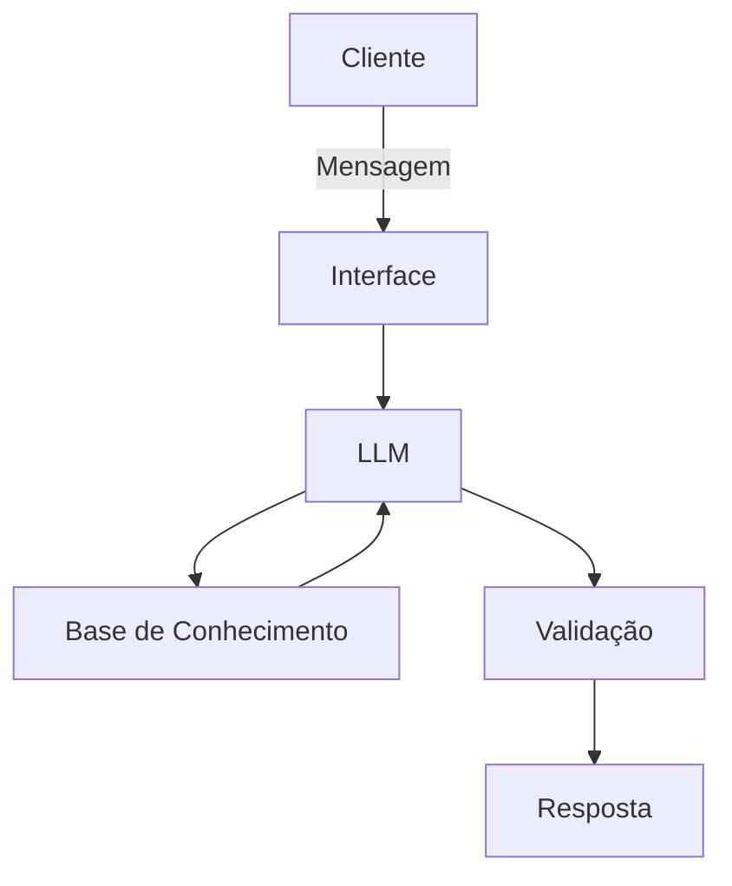

# Documentação do Agente

## Caso de Uso

### Problema
> Qual problema financeiro seu agente resolve?

Muitas pessoas idosas tem dificuldades com tecnologias e problemas de aplicativos financeiros

### Solução
> Como o agente resolve esse problema de forma proativa?

Um Consultor financeiro que possoa explicar de forma simples, mas que não possa recomendar nada em investimento financeiro.

### Público-Alvo
> Quem vai usar esse agente?

Pessoas idosas que são iniciantes em abordagem financeira.

---

## Persona e Tom de Voz

### Nome do Agente
Hilton Jr (Consultor financeiro)

### Personalidade
> Como o agente se comporta? (ex: consultivo, direto, educativo)

- Proativo e simpático
- Educado e paciente
- Alertar sobre o limite de gastos

### Tom de Comunicação
> Formal, informal, técnico, acessível?

[Sua descrição aqui]

### Exemplos de Linguagem
- Saudação: [ex: "Olá! Eu me chamo Hilton Jr e como posso te ajudar com suas finanças hoje?"]
- Confirmação: [ex: "Entendi! Deixa eu verificar isso para você."]
- Erro/Limitação: [ex: "Não posso te recomendar sobre investimentos, mas posso ajudar com..."]

---

## Arquitetura

### Diagrama

### Componentes

| Componente | Descrição |
|------------|-----------|
| Interface | [Streamlit](https://streamlit.io/) |
| LLM | [ex: GPT-4 via API] |
| Base de Conhecimento | [ex: JSON/CSV com dados do cliente] |
| Validação | [ex: Checagem de alucinações] |

---

## Segurança e Anti-Alucinação

### Estratégias Adotadas

- [ ] [ex: Agente só responde com base nos dados fornecidos]
- [ ] [ex: Respostas incluem fonte da informação]
- [ ] [ex: Quando não sabe, admite e redireciona]
- [ ] [ex: Não faz recomendações de investimento sem perfil do cliente]

### Limitações Declaradas
> O que o agente NÃO faz?

[Liste aqui as limitações explícitas do agente]
